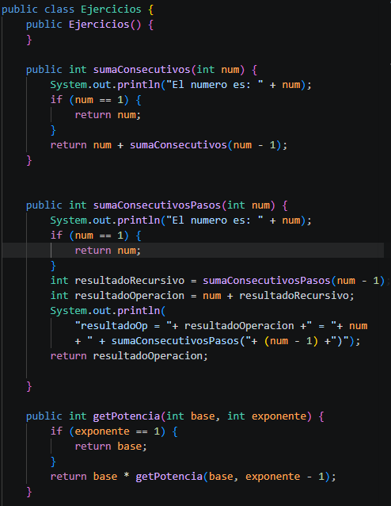
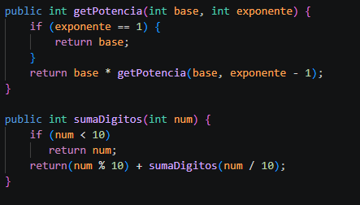
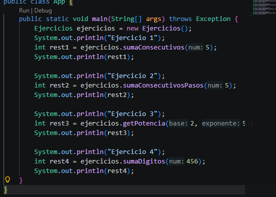

# Práctica: Recursividad en Java

## Datos del Estudiante

* **Nombre:** Jorge Padilla
* **Curso:** Computación
* **Fecha:** 11/05/2026

# 1. Clase `Ejercicios`

**Fecha:** 11/05/2026

**Descripción:**
Se creó la clase `Ejercicios`, donde se implementaron diferentes métodos recursivos en Java:

* `sumaConsecutivos(int num)` → suma números consecutivos desde `num` hasta 1.
* `sumaConsecutivosPasos(int num)` → muestra paso a paso cómo funciona la recursividad.
* `getPotencia(int base, int exponente)` → calcula la potencia de un número utilizando recursividad.
* `sumaDigitos(int num)` → suma los dígitos de un número entero.

---

# 2. Clase `App`

**Fecha:** 11/05/2026

**Descripción:**
Se creó la clase principal `App`, encargada de ejecutar los métodos de la clase `Ejercicios`.
Desde el método `main` se realizan pruebas de:

* Suma de consecutivos.
* Recursividad paso a paso.
* Potencias.
* Suma de dígitos.

Además, se muestran los resultados por consola utilizando `System.out.println`.

# 3. Ejecución del Programa

**Fecha:** 11/05/2026

**Descripción:**
Se ejecutó correctamente el programa mostrando:

* La suma de los números consecutivos.
* El proceso recursivo detallado.
* El cálculo de potencias.
* La suma de los dígitos de un número.

El proyecto permitió comprender el funcionamiento de la recursividad en Java y cómo las funciones pueden llamarse a sí mismas hasta llegar al caso base.

